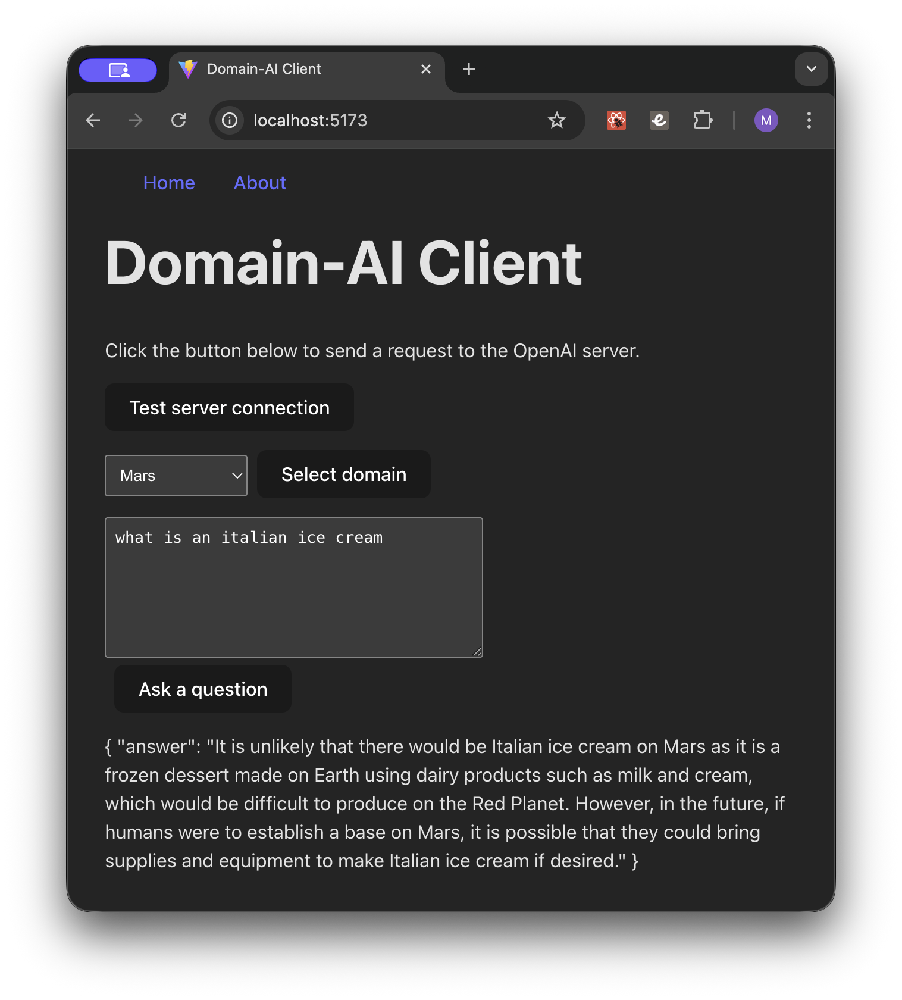

# Domain-AI

Proof-of-concept example project for constraining AI responses to a specific domain. The demo allows you to select a domain and ask a question. The default domain is "Austin, TX". The other two domain choices are "Tokyo, Japan" and "Mars".

The problem solved here is helping users get better answers faster when using AI. The issue is often one or both of the following: 1) the user does not know how to better tailor their questions; or 2) they don't have the time—figuring out all the exact questions to ask before asking your real questions can be time-consuming and error-prone. Why not prime the system with expert pre-questions to get the AI on track?

I imagine the next steps would be to create an expert system where the user answers questions and the server refines the request to the AI to get a better answer. The UI would then present a more tailored AI response and some additional next steps.


## Running the demo



- Clone the repo locally.
- Email me at mitchwilson1969@gmail.com to get a test api key.
- Set the test API key (which is read-only) as an environment variable. On Mac, for example, open a terminal and run:
	```sh
	export OPENAI_API_KEY=<TEST_KEY>
	```
- Run `npm install`
- Run `npm run dev` (this starts the server and the client)
- Open http://localhost:5173/ in your browser.


## Stopping the demo

- Press Control + C in the terminal running the server and client.


## Tech stack

The client is written using React and TypeScript.

The server is written using Node.js and JavaScript.

The AI used is the OpenAI API (GPT-4) on the server.

The OpenAI API key is stored locally on your computer running the demo, using the test API key you can receive from me. Email mitchwilson1969@gmail.com.

## How was AI used?

- OpenAI to ask questions and return results using their LLM
- Copilot (GPT-4.1 via github) used locally to:
    - Answer technical questions while coding the demo
    - Stub out starting code examples for features
    - Proof read the README